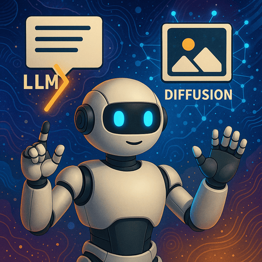
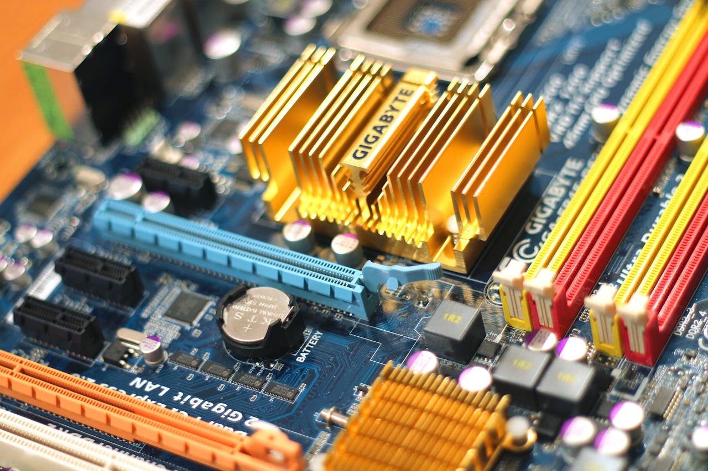

# Welcome to Deep Learning

## Today’s Goal

- This short introduction gives you a **map of the field**.
- Not deep theory, but a practical overview of what kinds of deep-learning systems you could build.
- The main goal today:
  - choose a technical path
  - choose a framework stack
  - start shaping your own project

## How This Part of the Course Works

- The course is short:
  - 4 lessons of 4 hours
  - plus the exam
- The first lesson already introduced you to practical generative AI.
- The remaining lessons are mainly for building your own project.
- So today is about **choosing a good direction**.

## How You Will Be Evaluated

- You will build a **unique AI application or prototype**.
- At the exam, you will:
  - present what you built
  - explain your design choices
  - defend your code and architecture
- You may use AI tools while building.
- But during the exam, **you** must understand what your system does.

# How to Choose a Project

## First Choose a Technical Path

- Before choosing an application, it is often easier to choose a **technical path**.
- In this course, the main paths are:
  - train or retrain your own model
  - build with pretrained foundation models
  - adapt / fine-tune large pretrained models
  - reinforcement learning
  - edge AI and deployment

## Then Choose an Application Direction

- After that, choose the domain where you want to apply that path.
- Good directions include:
  - computer vision
  - text / LLM apps
  - speech and audio
  - multimodal and document AI
  - time-series and sensor signals
  - semantic search / retrieval / recommendation
  - reinforcement learning
  - edge deployment

## A Good Project Formula

> Input -> AI model -> useful output -> interface

Examples:

- image -> detector -> labels and boxes -> web app
- user question + documents -> retrieval + LLM -> answer -> chat UI
- speech -> transcription -> summary -> web app
- sensor data -> anomaly detector -> warning -> dashboard

## Scope Matters

- Pick something interesting, but also feasible.
- A good project usually has:
  - one clear problem
  - one main framework
  - one demoable result
- Avoid choosing:
  - the hardest model training path
  - and the hardest deployment path
  - at the same time

# Technical Paths

## Path 1: Train or Retrain Your Own Model

- This is the classical deep-learning workflow:
  - dataset
  - model
  - training
  - evaluation
  - deployment
- Important:
  - this can still start from a pretrained model
  - for example MobileNet, YOLO, or another pretrained model
  - then you continue training it on your own data
- Good tools:
  - PyTorch
  - torchvision / torchaudio
  - YOLO
  - RF-DETR

## Path 2: Build With Pretrained Foundation Models

- Here the main work is **building around a model**, not training it from scratch.
- This is how many modern AI applications are made.
- Good examples:
  - chatbot
  - multimodal assistant
  - speech tool
  - image generator
  - semantic search app
- Good tools:
  - Hugging Face Transformers
  - Diffusers
  - Ollama
  - Sentence Transformers

## Path 3: Adapt or Fine-Tune Large Models

- This is different from normal transfer learning on a smaller model.
- For large foundation models, it is often not practical to retrain everything.
- Instead, you adapt part of the model using methods such as:
  - LoRA
  - PEFT
  - adapters
  - DreamBooth-style adaptation
- This path is powerful, but more ambitious.

## Path 4: Reinforcement Learning

- Reinforcement learning is about learning through:
  - interaction
  - reward
  - trial and error
- In this course, the most realistic projects are probably:
  - games
  - simulations
  - simple control tasks
- Good tools:
  - Gymnasium
  - Stable-Baselines3
  - TorchRL

## Path 5: Edge AI and Deployment

- You may want to focus less on training and more on **getting AI to run well on real hardware**.
- That is a very valid project path.
- Good examples:
  - deploy a vision model to an edge device
  - compare runtimes
  - optimize latency
  - deploy a small local LLM
- Good tools:
  - ONNX Runtime
  - Jetson / JetPack / TensorRT
  - Ollama or llama.cpp

# Application Directions

## Computer Vision

- Probably one of the easiest directions to demo well.
- Typical tasks:
  - classification
  - object detection
  - segmentation
  - visual inspection
- Strong frameworks:
  - PyTorch
  - Ultralytics YOLO
  - RF-DETR
  - OpenCV

## Language Models, Chat Systems, and Text Apps

- Strong option if you want to build something useful quickly.
- Typical tasks:
  - chatbot
  - summarization
  - classification
  - tool calling
  - text transformation
- Strong frameworks:
  - Ollama
  - Transformers
  - Sentence Transformers

## Multimodal and Document AI

- This is where language meets images, documents, or audio.
- Typical tasks:
  - visual question answering
  - document understanding
  - receipt or invoice reading
  - image-aware assistants
- Strong frameworks:
  - Transformers
  - vision-capable local models
  - document tools such as docTR

## Semantic Search, Retrieval, and Recommendation

- This is one of the most practical modern AI directions.
- It is based on embeddings:
  - represent items as vectors
  - compare them by meaning, not only by exact words
- Typical projects:
  - semantic search
  - retrieval-augmented chatbot
  - recommendation app
  - similar-item finder

## Speech, Audio, and Time-Series

- Good directions if you like signals rather than only text or images.
- Audio examples:
  - speech-to-text
  - text-to-speech
  - sound classification
- Time-series examples:
  - anomaly detection
  - forecasting
  - sensor monitoring

## Generative Systems Are Cross-Cutting

- Generative AI is important, but it is not one single modality.
- It can appear in:
  - text generation
  - image generation
  - speech generation
  - music generation
  - multimodal generation
- So instead of treating it as one separate box, think of it as a **style of model behavior** across several domains.

# Framework Suggestions

## Main AI Frameworks Worth Exploring

- **PyTorch**
  - best for direct training or retraining
- **Transformers**
  - best for pretrained language, multimodal, and speech models
- **Diffusers**
  - best for image generation and related workflows
- **Sentence Transformers**
  - best for embeddings, retrieval, and recommendation
- **Stable-Baselines3**
  - easiest RL starting point
- **ONNX Runtime**
  - strong deployment path

## Supporting Tools

- These are useful, but they are not the main AI choice:
  - Gradio
  - Streamlit
  - FastAPI
- Most of you will probably build some kind of interface.
- Gradio is a very good default if you want to move fast.

## My Recommendation If You Are Unsure

Start with one of these:

- a computer vision app with YOLO or RF-DETR
- an LLM app with Ollama or Transformers
- a retrieval / recommendation app with Sentence Transformers
- a speech tool
- an edge deployment project with a ready model

These are usually easier to scope well than reinforcement learning or large-model fine-tuning.

# Final Expectations

## What I Want to See

- a unique project
- a clear technical path
- one main framework stack
- visible effort
- a working demo or prototype
- understanding of the code and architecture

## Final Message

- Deep learning is a very broad field.
- You do not need to master all of it in this course.
- But I want you to leave this course with:
  - a better map of the field
  - experience building one real AI system
  - confidence that you can learn a new framework on your own

## What To Do Next

- choose a technical path
- choose a framework stack
- sketch a project idea
- start building
